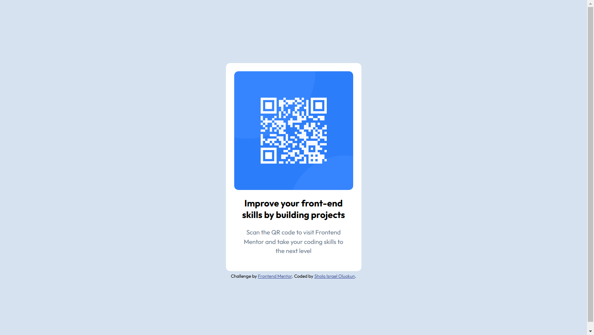

# Frontend Mentor - QR code component solution

This is a solution to the [QR code component challenge on Frontend Mentor](https://www.frontendmentor.io/challenges/qr-code-component-iux_sIO_H). Frontend Mentor challenges help you improve your coding skills by building realistic projects. 

## Table of contents

- [Frontend Mentor - QR code component solution](#frontend-mentor---qr-code-component-solution)
  - [Table of contents](#table-of-contents)
  - [Overview](#overview)
    - [Screenshot](#screenshot)
    - [Links](#links)
  - [My process](#my-process)
    - [Built with](#built-with)
    - [What I learned](#what-i-learned)
    - [Continued development](#continued-development)
    - [Useful resources](#useful-resources)
  - [Author](#author)

**Note: Delete this note and update the table of contents based on what sections you keep.**

## Overview

### Screenshot




### Links

- Solution URL: [Add solution URL here](https://your-solution-url.com)
- Live Site URL: [Add live site URL here](https://your-live-site-url.com)

## My process

### Built with

- Semantic HTML5 markup
- CSS custom properties
- Flexbox
- Mobile-first workflow

### What I learned

I had to check out some tips on flexbox layout at (https://developer.mozilla.org/en-US/docs/Web/CSS/CSS_flexible_box_layout/Aligning_items_in_a_flex_container#aligning_one_item_with_align-self)
Centering the whole content vertically and horizontally didn't come handy in the first place. Until I used min-height of 100vh and justify-content as center.
The documentation on mozilla.org was very useful for me.

To see how you can add code snippets, see below:

```html
<body>Some HTML code I'm proud of</body>
```
```css
body {
  min-height: 100vh;
  justify-content: center;
}
```

### Continued development

I'll like to focus more on content layout and interactivity using javaScript.

### Useful resources

- [Example resource 1](https://www.developer.mozilla.org) - This helped me for content layout. I really liked this pattern and will use it going forward.

## Author

- Website - [Oluwashola Israel Oluokun]
- Frontend Mentor - [@israel4u](https://www.frontendmentor.io/profile/israel4u)
- Twitter - [@Oluwashola3113](https://www.twitter.com/Oluwashola3113)